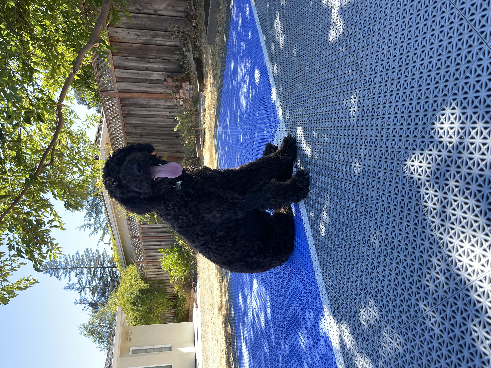

# Sirisha Munukutla - User Page
## About Me

**Major:** Computer Science

**Year:** 2nd Year Transfer

**Community College:** De Anza College

**Hometown:** Bay Area, California

### Fun Facts

A quote by Mike Tyson I have on a poster on my bedroom wall is:
> Everyone has a plan until they get punched in the face.

My favorite programming language is C++ because I am most comfortable with it, as most of my classes so far have been taught in C++.

```
#include <iostream>
cout << "Looking forward to a great quarter!" << endl;
```

My cousin recently got a dog. Her name is Mia and she's a five month old labradoodle. Here is a picture of her just for smiles:)


### Hobbies
I really enjoy baking! I generally do cookies, but I just started baking cakes this year. These are some of the cakes I've baked so far:
- Lemon cake with vanilla buttercream and pomegranate seed filling
- Tres leches cake with whipped cream and decorative strawberries
- White cake with dark chocolate ganache filling and coffee buttercream frosting
- Chocolate and vanilla cake with whipped dark chocolate ganache filling and crumb coat, coffee buttercream, and decorative chocolate truffles
- Chocolate cake with whipped dark chocolate filling, whipped espresso milk chocolate frosting, milk chocolate ganache poured over, and decorative chocolate sugar cookies

I love to read! My current favorite authors, in order, are:
1. Sidney Sheldon
2. Harlan Coban
3. Rainbow Rowell
4. John Grisham

Last year when the pandemic started, I started painting for fun. Here are some of my favorite [paintings](paintings.md).

I enjoy playing sports. In the past, I've played:
- basketball
- softball
- volleyball
- soccer

This year, I want to try to learn some new sports/skills. Here are some that I am interested in trying on campus:
- [ ] Aerial silks
- [ ] Ultimate frisbee
- [ ] Tennis
- [ ] Badminton
- [ ] Climbing

## Contact Information
[LinkedIn Page](www.linkedin.com/in/sirisha-munukutla)
[smunukutla@ucsd.edu](smunukutla@ucsd.edu)